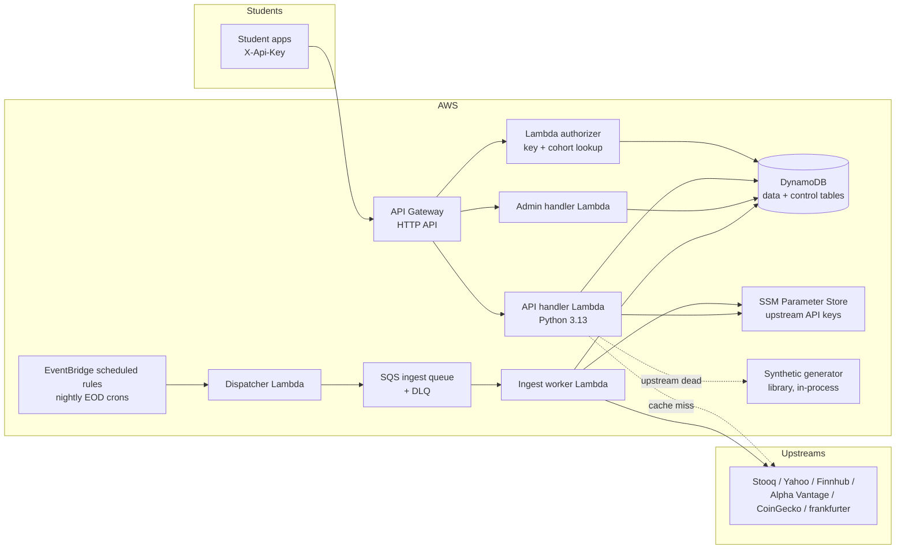

# 01 — Architecture

## Components

### Service choices and why

| Component | Choice | Why |
|---|---|---|
| API front door | **API Gateway HTTP API (v2)** | ~1/3 the cost of REST API; supports Lambda authorizers. We forgo REST-API "usage plans" because our quota model lives in DynamoDB anyway (per-key daily quotas, cohort grouping, instant revoke) — richer than usage plans and portable. |
| Auth | **Lambda authorizer** (payload v2, response caching 300 s) | Looks up hashed key in the control table, attaches key/cohort context to the request. Cached so most requests skip the lookup. |
| Compute | **Five Python 3.13 Lambdas** (arm64) | `api` (monolithic router for public routes), `authorizer`, `dispatcher`, `ingest-worker`, and `admin`. Monolithic public/admin handlers keep deploy units manageable; split later only if profiling demands it. |
| Storage | **DynamoDB, provisioned capacity within the always-free 25 RCU/25 WCU** | EOD-scale data is small (see [03-data-model](03-data-model.md)); provisioned-free beats on-demand pricing at near-zero budget. Switch to on-demand only if throttling appears. |
| Scheduling | **EventBridge scheduled rules** | Cron per market close (US, India, daily FX/crypto). Free tier covers them. |
| Ingest fan-out | **SQS standard queue + DLQ** | Dispatcher enqueues symbol batches; worker consumes with per-source rate budgets. DLQ + redrive gives free retry semantics and visibility into failed symbols. |
| Secrets | **SSM Parameter Store `SecureString`** (standard tier, free) | Upstream API keys (Finnhub, Alpha Vantage, CoinGecko Demo). Not Secrets Manager — $0.40/secret/month is the entire monthly budget. |
| Observability | **CloudWatch Logs (14-day retention) + a few alarms** | Structured JSON logs via Lambda Powertools; alarms on DLQ depth, authorizer errors, 5xx rate. |

## Request flows

### 1. Read path (candles / symbols) — cache-first

1. Request hits API Gateway with `X-Api-Key`.
2. Authorizer (or its cache) validates key hash, checks key status, injects
   `keyId`/`cohortId` context. Usage is keyed by the non-secret `keyId`; the key
   hash never leaves the authorizer/control-table lookup path.
3. API Lambda checks + increments the daily quota counter (control table).
4. Query the data table. **EOD candles are immutable once written** — served
   straight from DynamoDB, no upstream call.
5. Unknown symbol → on-demand path: register symbol, serve what can be fetched
   synchronously (bounded to ~3 s), enqueue a historical backfill, return `202`
   with `Retry-After` if nothing is servable yet. See [04-ingestion](04-ingestion.md).

### 2. Quote path — TTL cache with layered fallback

1. Steps 1–3 as above.
2. Look up cached quote item. Fresh (`fetchedAt` is within the application
   freshness window, default 300 s) → return with `meta.source: "cache"`.
3. Stale → try quote-capable adapters in priority order within a strict time
   budget; on success, write-through cache and return `meta.source: "upstream:<name>"`.
4. All upstreams fail/budget exhausted → serve stale cache (`meta.stale: true`),
   or synthesize from last EOD close (`meta.source: "synthetic"`). Never 5xx
   because a free upstream had a bad day.

### 3. Ingest path (nightly)

1. An EventBridge scheduled rule fires per market after close (see [04-ingestion](04-ingestion.md)
   for the cron table).
2. A tiny dispatcher enumerates the symbol universe for that market and enqueues
   SQS messages in batches of ~25 symbols.
3. Ingest worker (reserved concurrency = 2, to respect upstream rate limits)
   pulls batches, calls the preferred adapter for each symbol, normalizes, writes candle
   chunks + updates each symbol's `coverage.eodTo` value.
4. Failures retry via SQS; poisoned batches land in the DLQ and trip an alarm.

Each successful market ingest conditionally advances a small market-status item
(`MARKET#<market>` / `STATUS`). The unauthenticated health route reads those four
items rather than scanning the symbol registry.

### 4. Admin path

`/v1/admin/*` routes require an **admin key** (separate key type, same auth
mechanism, additionally pinned by an SSM-stored allowlist). Used by the operator
CLI for key issuance, cohort management, backfill triggers, and ingest-job status.

## Tenets

- **Cache-first, upstream-second, synthetic-last.** Students should almost never
  wait on a third-party API.
- **Upstreams are untrusted.** Every adapter call has a timeout, a per-source
  daily/minute budget tracked in the control table, and a circuit breaker.
- **Immutable observations.** Once an EOD candle is accepted, its raw values do
  not change. Corporate-action metadata may change, so read-time `adjclose` may
  change without rewriting the raw candle.
- **One region:** `eu-west-2`, deployed through the `megh.io` shared AWS profile.
  No multi-region ambitions.
- **Two IaC tools, one owner per resource.** Serverless Framework deploys
  compute and wiring; Terraform deploys everything stateful, shared, or secret.
  The Phase 1 boundary is defined in [06-infrastructure](06-infrastructure.md).
